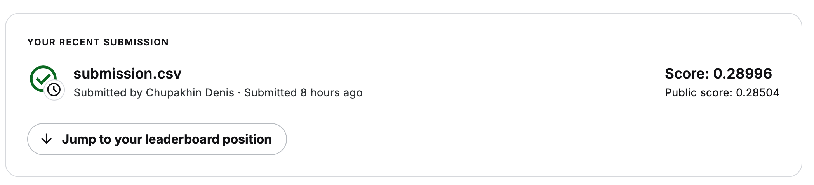

# Porto Seguro’s Safe Driver Prediction

Решение соревнования [Porto Seguro’s Safe Driver Prediction на Kaggle](https://www.kaggle.com/competitions/porto-seguro-safe-driver-prediction). Задача — предсказать вероятность страхового требования по анонимизированным характеристикам клиента. Основная метрика — нормированный Gini; в ноутбуке он вычисляется как `2 × ROC-AUC − 1`.

## Результат

| Показатель | Значение |
|---|---:|
| Public Score | **0.28504** |
| Private Score | **0.28996** |
| Локальный validation Gini финального стекинга | **0.2835** |

По сохранённому сравнению с историческим **private** leaderboard результат 0.28996 выше порога Top 10% (0.28995 на позиции 516), но ниже порога Top 5% (0.29023 на позиции 258). Это ориентир уровня качества.

После добавления файлов ссылки ниже станут рабочими:



[Финальный submission.csv](submission.csv)

## Подход: baseline → улучшения → финальное решение

### Baseline

Проведены анализ распределений признаков и проверка дисбаланса классов: в обучающей выборке 595 212 объектов, из них 21 694 положительных. Рассмотрены SVM, Random Forest, Gradient Boosting, LightGBM, XGBoost и CatBoost. Для SVM использовалась стратифицированная подвыборка до 10 000 объектов.

Исходная подготовка включала заполнение числовых пропусков медианой, One-Hot-кодирование категорий и масштабирование для части экспериментов. Качество оценивалось по Gini на стратифицированном разбиении 80/20.

### Улучшения

- Исключены `id` и группа `ps_calc_*` из входных признаков; `target` используется только как целевая переменная.
- Добавлен `missing_count` — количество пропусков `-1` или `NaN` в оставшихся исходных признаках.
- Добавлен `ind_bin_sum` — количество активных бинарных признаков группы `ps_ind_*`.
- Добавлены частоты категорий `*_cat_count`.
- Добавлен `new_ind_count` — частота комбинации всех исходных `ps_ind_*`.
- Для локального стекинга частоты рассчитываются на обучающей части и применяются к validation; неизвестные значения получают частоту 0.
- Imputer и One-Hot перенесены в Pipeline каждой базовой модели, чтобы обучаться внутри фолдов стекинга.
- Сравнены ручной блендинг и стекинг с логистической метамоделью.

Отношения `ps_car_12_div_*` рассматривались в предыдущих экспериментах, но в текущей `make_features()` отсутствуют. Изначально они помогали повысить качество моделей, но с какого-то момента начали мешать.

### Финальное решение

Используется `StackingClassifier` из трёх моделей:

| Модель | Основные параметры |
|---|---|
| LightGBM | `n_estimators=500`, `learning_rate=0.1`, `max_depth=3`, `reg_alpha=10` |
| CatBoost | `iterations=500`, `learning_rate=0.1`, `depth=5` |
| XGBoost | `n_estimators=500`, `learning_rate=0.1`, `max_depth=3`, `reg_alpha=10` |
| Метамодель | `LogisticRegression(C=1, max_iter=500, random_state=23)` |

Для получения признаков метамодели используется `StratifiedKFold(n_splits=5, shuffle=True, random_state=23)`. На вход метамодели поступают вероятности базовых моделей; исходные признаки к ним не добавляются. Числовые пропуски заполняются медианой, категории кодируются через One-Hot.

После локальной проверки стекинг заново обучается на полном train. Частоты пересчитываются по полному train и применяются к Kaggle test. Результат сохраняется в `submission.csv` со столбцами `id,target`; `target` содержит вероятность класса 1.

## Что сработало лучше всего

Лучший сохранённый результат финального блока — стекинг LightGBM, CatBoost и XGBoost: **validation Gini 0.2835**.

Частоты категорий и комбинаций, учёт пропусков и объединение бустингов вошли в итоговую схему. Отдельный прирост от каждого признака не измерен, поэтому ему не приписывается конкретное улучшение Gini.

## Что не сработало

- SVM с sigmoid-ядром на подвыборке уступал бустингам: лучший сохранённый Gini — около 0.21840; при больших значениях `gamma` встречался Gini 0.
- SVM, Random Forest и стандартный Gradient Boosting не вошли в финальное решение по итогам экспериментов с качеством и временем обучения.
- В предыдущем сравнении двух моделей простое и взвешенное усреднение уступили стекингу; добавление среднего к прогнозу стекинга также ухудшило результат.
- Ослабление регуляризации метамодели с `C=1` до `C=10` почти ничего не изменило: 0.281113 → 0.281112.
- Замена заполнения медианой на `-1` в отдельном эксперименте не дала улучшения; точная оценка этого запуска не сохранена в текущем ноутбуке.

## Воспроизведение

### 1. Подготовить окружение

Создать отдельное окружение Python и установить зависимости:

```bash
python -m venv .venv
source .venv/bin/activate
python -m pip install numpy pandas scipy matplotlib seaborn scikit-learn lightgbm xgboost catboost jupyterlab
```

Версии исходного окружения не зафиксированы. Команда устанавливает необходимые пакеты, но не гарантирует побитовое совпадение прогнозов. Для точного повторения нужно сохранить версии из окружения финального запуска, например `python -m pip freeze > requirements.txt`, а также версию Python.

### 2. Подготовить данные и ноутбук

Скачать `train.csv` и `test.csv` со [страницы данных соревнования](https://www.kaggle.com/competitions/porto-seguro-safe-driver-prediction/data). Разместить их в каталоге `porto-seguro-safe-driver-prediction/` рядом с ноутбуком. Для удобства назвать приложенный ноутбук `research.ipynb`.

В первой ячейке загрузки заменить абсолютный путь автора:

```python
url_train = "porto-seguro-safe-driver-prediction/train.csv"
```

Запускать Jupyter из корня проекта:

```bash
jupyter lab research.ipynb
```

### 3. Запустить финальную схему

Для воспроизведения финального решения не требуется повторять все переборы SVM и бустингов. После перезапуска ядра выполнить по порядку:

1. Первую ячейку с импортами и `RANDOM_STATE = 23`.
2. Ячейку с импортами sklearn и чтением `df_train`.
3. Дополнительные импорты и объявление имён классов ниже.
4. Ячейку с определением `make_features()`.
5. Ячейку с `results = {}` и определением `evaluate_model()`.
6. Ячейку локального стекинга, начинающуюся с `from sklearn.base import clone` и разделения исходного `df_train` на `train_part` и `valid_part`.
7. Ячейку под заголовком «Обучение stacking на полном train и прогноз для test».

Дополнительная ячейка для такого сокращённого запуска:

```python
import time
from sklearn.impute import SimpleImputer
from lightgbm import LGBMClassifier
from xgboost import XGBClassifier
from catboost import CatBoostClassifier

class_names = ["0", "1"]
```

После последнего шага появится `submission.csv`. Ячейки получения списка отправок через Kaggle CLI и анализа локальной выгрузки leaderboard нужны только для отчёта, а не для обучения. Они требуют отдельно настроенного Kaggle CLI и CSV лидерборда соответственно.

### Ограничения воспроизводимости и оценки

- `random_state=23` зафиксирован для разбиений и метамодели; в текущем коде базовые модели используют значения seed по умолчанию библиотек.
- Частотные признаки вычисляются до внутренних фолдов стекинга. Внешняя validation исключена из их расчёта, но внутри стекинга частоты общие.
- Старые экспериментальные блоки считают частоты до внешнего разделения и используют другой порядок предобработки. Их оценки нельзя считать полностью сопоставимыми с финальным блоком.
- Сохранённые выводы исследовательских ячеек могут относиться к предыдущим запускам. Точный CSV, соответствующий отправке `56736328`, необходимо приложить отдельно: повторное обучение не доказывает идентичность этой отправке.
